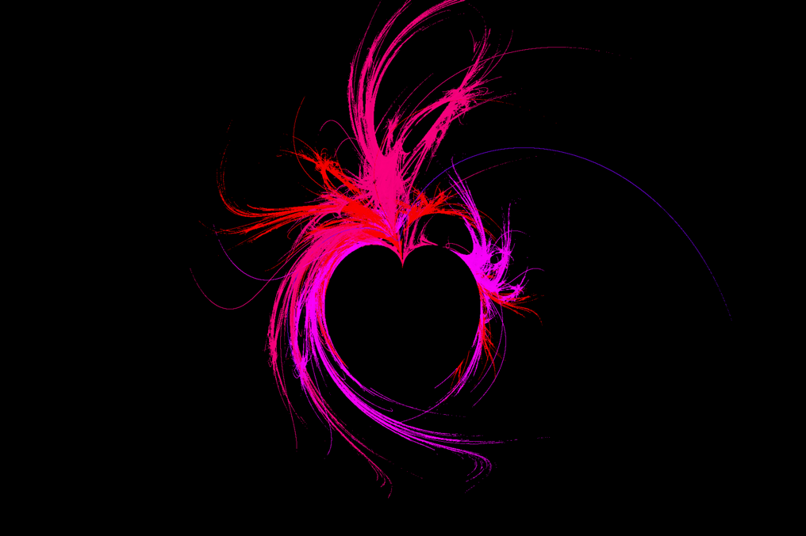
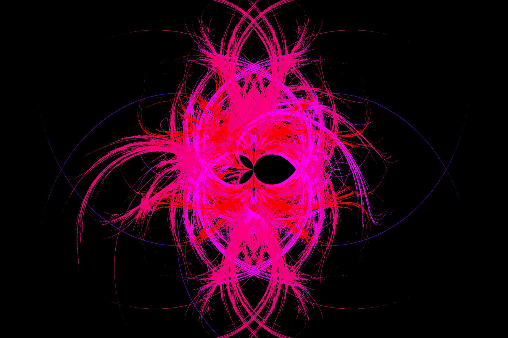
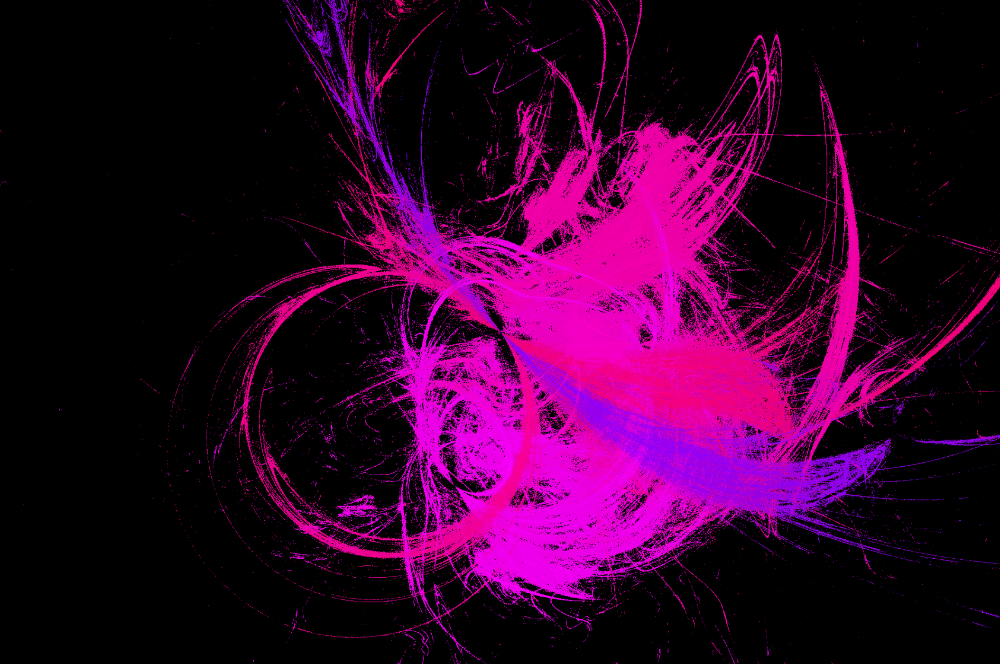
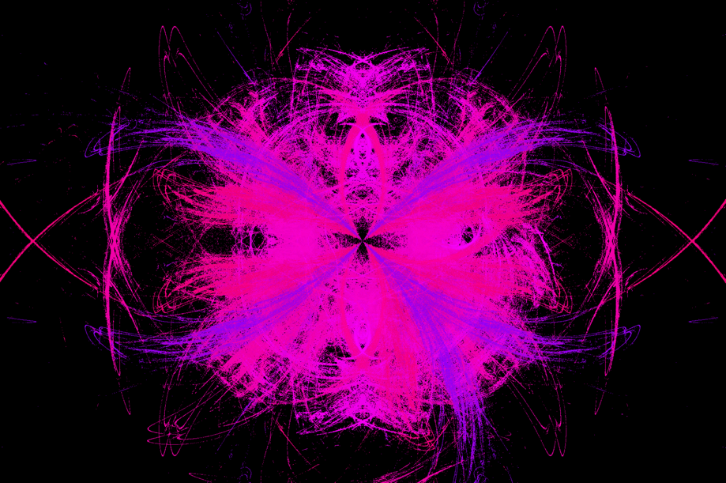
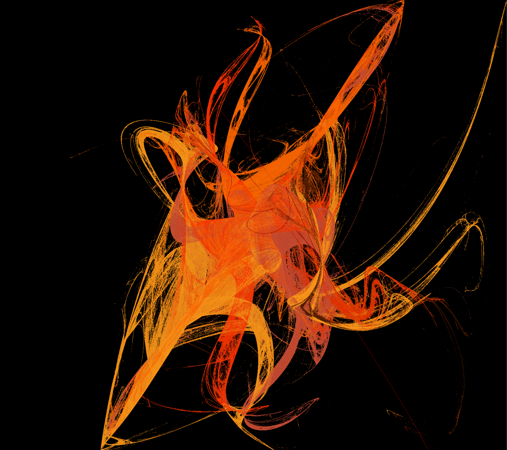
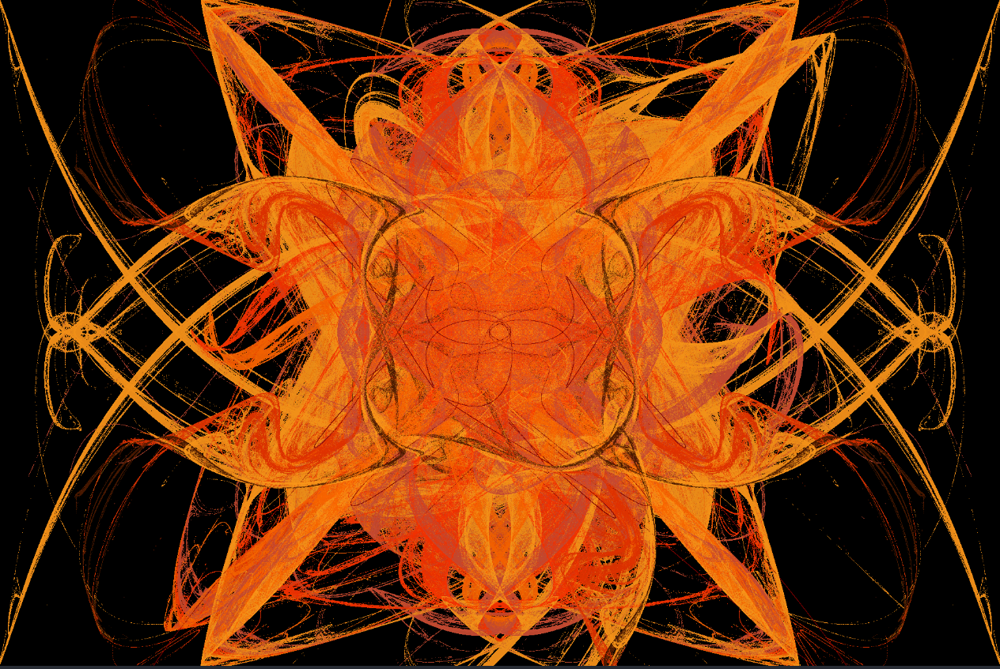
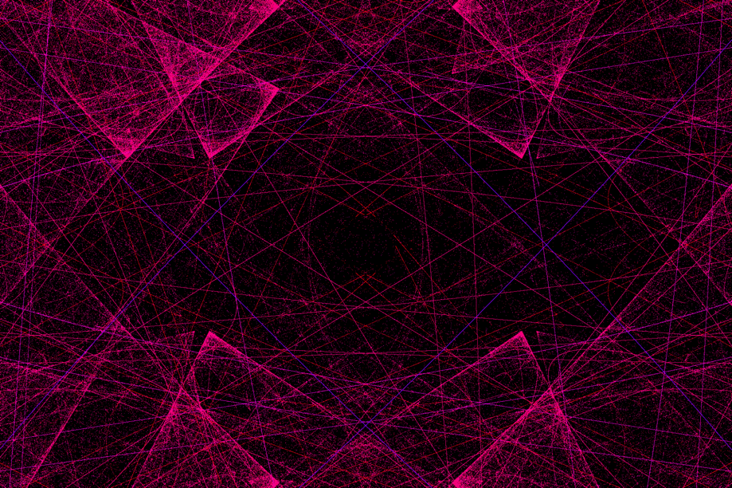
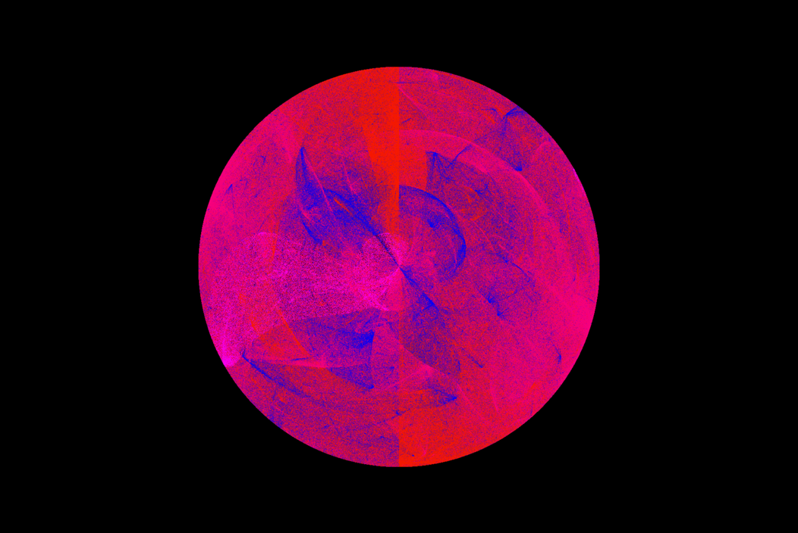
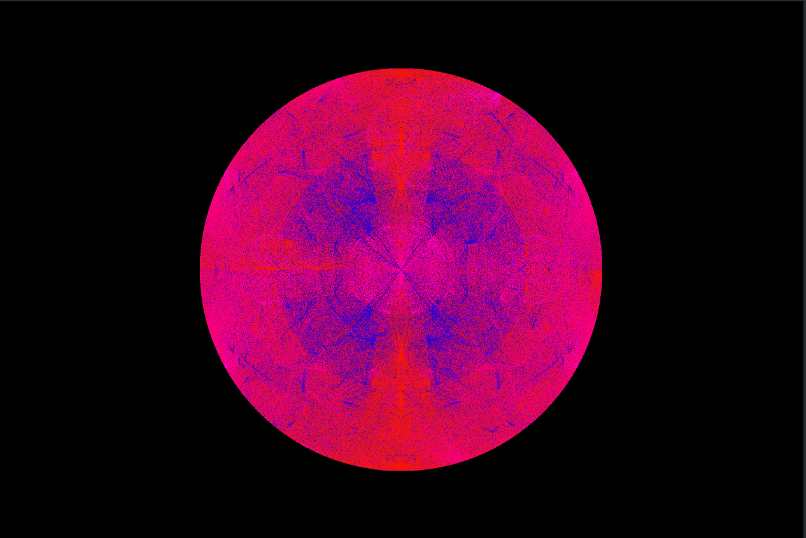

# Фрактальное пламя

## Примеры 

### Изображение сердца

Без симметрии (30000 итераций)

С симметрией (30000 итераций)

### Сферическое изображение

Без симметрии (8000 итераций)

С симметрией (3000 итераций)

### Изображение пламени

Без симметрии (30000 итераций)

С симметрией (30000 итераций)

### Синусоидальное изображение

Без симметрии (18000 итераций)

С симметрией (6000 итераций)

### Изображение диска

Без симметрии (30000 итераций)

С симметрией (30000 итераций)

## Тест скорости

### Параметры

Процессор: Apple M2 Max (12 ядер, 12 потоков)
 Оперативная память: 32GB

### Сравнение

Для генерации изображений использовалось 10 потоков
1) Изображение сердца

    * Многопоточный режим: 7 секунд 631 мс.
    * Однопоточный режим: 47 секунд 667 мс.

2) Сферическое изображение

    * Многопоточный режим: 0 секунд 404 мс.
    * Однопоточный режим: 1 секунды 496 мс.

3) Изображение пламени

    * Многопоточный режим: 12 секунд 953 мс.
    * Однопоточный режим: 81 секунд 265 мс.

4) Синусоидальное изображение

    * Многопоточный режим: 1 секунда 655 мс.
    * Однопоточный режим: 13 секунд 329 мс.

5) Изображение диска

    * Многопоточный режим: 8 секунд 35 мс.
    * Однопоточный режим: 49 секунд 874 мс.

